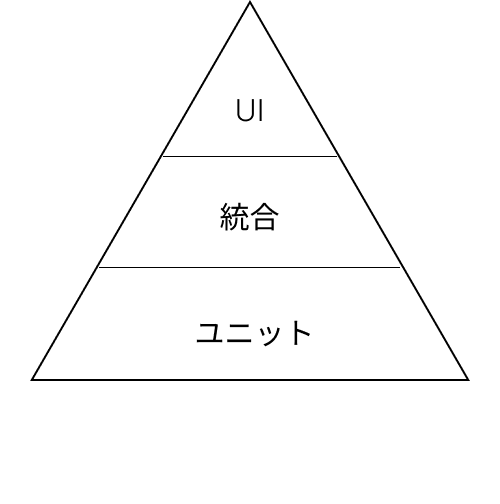

開発しているプロダクトに「バグが増えてきたのでとりあえず導入した方が良さそう」と、ふわっとした理由で自動テストを導入しました。

しかし、テストを書ける状態にはしましたが、そもそも自分はテストを運用した経験がなく体系的な知識はないままだったので、あらためて本書を読んでテストの知見をたくわえようと思いました。

本記事は[初めての自動テスト](https://amzn.to/3Xj649d)の「第Ⅰ部１章　テストのピラミッド」についての読書メモです。

## テストのピラミッドとは

自動テストは大きくUIテスト（E2Eテスト）、統合テスト、ユニットテストの３種類に分けられ、以下のように説明されています。

UIテスト

ユーザーがシステムを使用するときと同じように振る舞うテスト。E2Eテストとも呼ばれる。

統合テスト

UIは通さずに、UIを動かしている基盤の部分を直接動かすテスト

ユニットテスト

小さく正確でコードレベルで行うテスト

これらの異なるテストがどのようにお互いを補完し合っているかを表現したモデルをテストのピラミッドと呼び、下図のような構成で表されます。

**そしてほとんどのWebアプリケーションのアーキテクチャはUI層、サービス層、ロジック層の３つの層で構成されていて、各層はテストのピラミッドの特定の層に対応していることが重要だと述べています。**

## UIテスト

UIテストはアーキテクチャの全ての層を通過しているため、非常に魅力的に**見える**と述べています。しかし、UIテストは遅く壊れやすいという特性を持つため、一番少ないピラミッドの頂点で表現されます。

## 統合テスト

統合テストは複数の層の動作を確認できる上に、UI層を通過しないためUIの壊れやすさの影響を受けない強みがあると述べています。ただし、統合テストは詳細ではなく、問題の箇所を特定しづらいという欠点があります。

## ユニットテスト

ユニットテストは正確性、スピード、カバレッジにおいて優れており、自動テストの父とまで本書では称されています。唯一の欠点は、全体を通して問題がないか分からないことです。

## 親指の法則

これまで見てきたように、自動テストには３種類ありそれぞれ特性があります。では、いざ自動テストを導入するときにどのテストを追加していけばいいのでしょうか？

その考え方を示したのが親指の法則です。本書では以下のように述べられています。

1. UIよりもユニットテストを優先すること。

3. ユニットテストで埋められない部分を統合テストでカバーすること。

5. UIテストは限定的に使うこと。

つまり、ピラミッドの上にいくほど遅くてコストのかかるテストになるため、テストを追加するときはピラミッドの最下層から始めて、必要に応じて上の層のテストを追加していこうということです。

ちなみに、なぜこれを親指の法則というのかは明記されておらず、調べても分からなかったです、、

## 最後に

本書は自動テストを導入する人にとって最初の道標となるような内容でした。

私がテストを作っていく前にぜひとも読んでおきたかったです。

自動テスト書いたことないけど興味がある人や、とりあえず書いてるけどあらたまって勉強したことがない人などにオススメできる内容だと思います。

興味がある方はぜひ読んでみてください！
