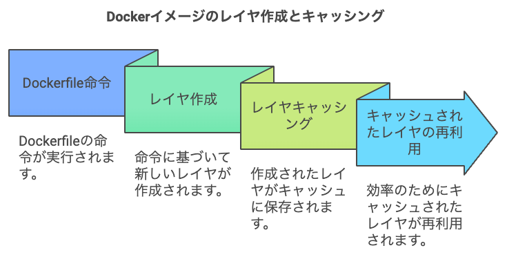
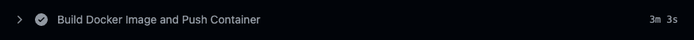
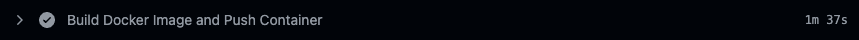

## 概要

GItHub Actionsで実行していたDockerイメージのビルド時間を高速化しました。

結論として、**レイヤーキャッシュの最適化とDocker BuildxとGitHub Actionsのキャッシュ機能を利用することで、Dockerイメージのビルド時間を約50%短縮すること**ができました。

## レイヤーキャッシュとは

**レイヤーキャッシュ**は、Dockerがイメージをビルドする際に各命令（RUN, COPY, ADD など）ごとに作成されるキャッシュのことです。これにより、以前と同じ命令とコンテキストであれば、ビルド済みのレイヤーを再利用できます。適切にレイヤーキャッシュを活用することで、ビルド時間を大幅に短縮できます。



レイヤーキャッシュは以下の条件で無効になります。

**レイヤーキャッシュが無効になる条件**

- Dockerfile内の命令が変更された場合。

- 命令に関連するファイル（例えば COPY するファイル）が変更された場合。

- 以前のレイヤーが変更された場合、その後のすべてのレイヤーキャッシュも無効になる。

## ワークフローの改善

### 修正前のワークフロー

```
- name: Build Docker Image and Push Container
  run: |-
    docker build -t "${{ env.REGION }}-docker.pkg.dev/${{ env.PROJECT_ID }}/docker/${{ env.SERVICE }}:${{ github.sha }}" -f ./Dockerfile .
    docker push "${{ env.REGION }}-docker.pkg.dev/${{ env.PROJECT_ID }}/docker/${{ env.SERVICE }}:${{ github.sha }}"
```

dockerコマンドを利用してビルドとプッシュを行うシンプルな構成です。

**キャッシュを利用していないため**、毎回すべてのレイヤーを再ビルドしていてビルド時間が長くなっている。

### 修正後のワークフロー

```
- name: Set up Docker Buildx
  uses: docker/setup-buildx-action@v3

- name: Extract metadata (tags, labels) for Docker
  id: meta
  uses: docker/metadata-action@v5
  with:
    images: ${{ env.REGION }}-docker.pkg.dev/${{ env.PROJECT_ID }}/docker/${{ env.SERVICE }}
    tags: ${{ github.sha }}

- name: Build Docker Image and Push Container
  uses: docker/build-push-action@v5
  with:
    context: .
    file: ./Dockerfile
    push: true
    tags: ${{ steps.meta.outputs.tags }}
    labels: ${{ steps.meta.outputs.labels }}
    cache-from: type=gha
    cache-to: type=gha,mode=max
```

### 解説

各ステップの解説をします。

#### **Docker Buildxのセットアップ**

```
- name: Set up Docker Buildx
  uses: docker/setup-buildx-action@v3
```

  
BuildxはDockerビルドの機能を拡張したCLIプラグインで、**マルチプラットフォームビルドやビルドキャッシュの高度な管理を可能**にします。

例としてBuildxは**キャッシュのインポート/エクスポート機能**をサポートしていて、レイヤーキャッシュを外部に保存・取得できます。これにより、実行ごとに環境が異なるGithub Actionsでもキャッシュを共有し、ビルド時間を短縮することができます。  
  
docker/setup-buildx-action は、GitHub Actions上でBuildxをセットアップするためにDockerが提供している公式のアクションで、上記のように、**uses: docker/setup-buildx-action@v3 と指定するだけで、Buildxがセットアップされます**。

#### **メタデータの抽出**

```
- name: Extract metadata for Docker
  id: meta
  uses: docker/metadata-action@v5
  with:
    images: ${{ env.REGION }}-docker.pkg.dev/${{ env.PROJECT_ID }}/docker/${{ env.SERVICE }}
    tags: ${{ github.sha }}
```

  
docker/metadata-action は、**Dockerイメージのタグやラベルを自動的に生成**するためのアクションです。  
リポジトリの情報（ブランチ名、コミットSHA、Gitタグなど）をもとに、イメージのタグやラベルを生成することができます。今回はコミットSHAをタグに設定しています。

#### **Dockerイメージのビルドとプッシュ**

```
- name: Build Docker Image and Push Container
  uses: docker/build-push-action@v5
  with:
    context: .
    file: ./Dockerfile
    push: true
    tags: ${{ steps.meta.outputs.tags }}
    labels: ${{ steps.meta.outputs.labels }}
    cache-from: type=gha
    cache-to: type=gha,mode=max
```

Buildxのキャッシュインポート/エクスポート機能を利用してDockerイメージをビルドし、コンテナレジストリにプッシュしています。

- cache-from: type=gha
    - 前回のビルドキャッシュをGitHub Actionsのキャッシュサービスからインポートします。

- cache-to: type=gha, mode=max
    - ビルド後のキャッシュをGitHub Actionsのキャッシュサービスにエクスポートします。
    
    - mode=maxにすることで可能な限り多くのキャッシュを保存するようになります。

**シンプルな記述で****Actions上でレイヤーキャッシュの利用を可能**にしている。

## Dockerfileの改善

### 修正前のDockerfile

```
FROM node:20-alpine AS base
WORKDIR /app

FROM base AS builder
COPY . .
RUN npm install
RUN npm run build

FROM base AS runner
COPY --from=builder /app /app
CMD ["node","server.js"]
```

依存関係のインストールとNextのビルドが一つのビルドステージに含まれており、**レイヤーキャッシュが効果的に利用**できていない状態です。例えばソースコードの変更があると、キャッシュが無効になり、すべてのレイヤーが再ビルドされてしまいます。

### 修正後のDockerfile

```
FROM node:20-alpine AS base

FROM base AS deps
WORKDIR /app
COPY ./package*.json ./
RUN npm ci

FROM base AS builder
WORKDIR /app
COPY --from=deps /app/node_modules ./node_modules
COPY . .
RUN npx prisma generate
RUN npm run build

FROM base AS runner
WORKDIR /app
COPY --from=builder --chown=node:node /app/.next/standalone ./
COPY --from=builder --chown=node:node /app/.next/static ./.next/static
COPY --from=builder --chown=node:node /app/public ./public

CMD ["node","server.js"]
```

### 解説

**マルチステージビルドの効果的な活用**

- deps ステージ
    - 依存関係のインストールを専用のステージに分離。
    
    - package\*.json をコピーし、npm ci を実行。
    
    - レイヤーキャッシュが有効であれば、このステージの再ビルドを避けられます。

- builder ステージ:
    - deps ステージから node\_modules をコピー。
    
    - ソースコードをコピーし、ビルドを実行。
    
    - ソースコードの変更があっても、依存関係に変更がなければ、deps ステージのキャッシュが再利用され、ビルド時間が短縮されます。

- runner ステージ:
    - ビルド成果物のみを含めた実行用のイメージを作成。
    
    - 不要なビルドツールやソースコードを含まないため、イメージサイズが小さくなります。

**頻繁に変更されない依存関係のインストールを先に配置**し、ソースコードのみ変更された場合は依存関係のレイヤーキャッシュが再利用され、ビルド時間が短縮されます。

## **まとめ**

レイヤーキャッシュの最適化し、Buildxのキャッシュ機能とGitHub Actionsのキャッシュサービスを連携させることで、ビルド時間を高速化することができました。

ビルドにかかった時間を実際に見ててみると、今まで実行する度に約3分かかっていましたが、依存関係のキャッシュが効いている場合は約1m35sくらいまでなったので、実質ビルド時間を**約50%短縮**することができました。

<figure>



<figcaption>

キャッシュが効いていない場合→3m 3s

</figcaption>

</figure>

<figure>



<figcaption>

依存関係のキャッシュが効いた場合→1m 37s

</figcaption>

</figure>

<figure>


<figcaption>

キャッシュがフルで効いた場合→13s

</figcaption>

</figure>
