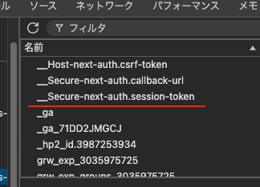

## はじめに

next-authのjwtによる認証で、サインインは成功するのに**middlewareの処理でcookieに保存されているはずのtokenを取得するとnull**になるという現象で困っていた。

issueを調べてみると同じようなことで困っている人がちらほらいたので、一瞬next-auth側を疑ったが、  
クリティカルな内容にも関わらず未だに修正されていないのはおかしいと思い、もう少し自分を疑ってみることにした。

## 原因

**NextAuthOptionsでcookie名をカスタムしていた**ため、withAuth側でカスタムしたcookie名を指定する必要があった。

NextAuthOptionsは以下のように記述していた。

```typescript
import { NextAuthOptions } from "next-auth"
import { PrismaAdapter } from "@next-auth/prisma-adapter"
import CredentialsProvider from "next-auth/providers/credentials"
import { prisma } from "@/lib/prisma"
import { verifyPassword } from "@/lib/password"

export const authOptions: NextAuthOptions = {
  debug: false,
  adapter: PrismaAdapter(prisma),
  secret: process.env.NEXTAUTH_SECRET,
  session: {
    strategy: "jwt",
    maxAge: 30 * 24 * 60 * 60, // 30日間
  },
  providers: [
    CredentialsProvider({
      name: "user",
      credentials: {
        email: { label: "Email", type: "text" },
        password: { label: "Password", type: "password" },
      },
      async authorize(credentials) {
        if (!credentials) return null

        const user = await prisma.user.findUnique({
          where: { email: credentials.email },
        })

        if (!user) {
          return null
        }

        const isValid = await verifyPassword(credentials.password, user.password)

        if (!isValid) {
          return null
        }

        return { id: user.id, email: user.email, role: user.role }
      },
    }),
  ],
  callbacks: {
    async jwt({ token, user }) {
      if (user) {
        token.id = user.id
        token.role = user.role
      }
      return token
    },
    async session({ session, token }) {
      if (token) {
        session.user.id = token.id
        session.user.role = token.role
      }
      return session
    },
  },

  // ここでnext-authで設定されるCookieをカスタムしている
  cookies: {
    sessionToken: {
      name: "next-auth.session-token",
      options: {
        httpOnly: true,
        secure: process.env.NODE_ENV === "production",
        path: "/",
      },
    },
  },
}
```

cookiesプロパティでsessionTokenのnameを`next-auth.session-token`カスタムしているが、デフォルトだと`__Secure-next-auth.session-token` という名前でcookieに保存される。



そのため、cookie名をカスタムした場合、**WithAuth側でもカスタムしたCookie名を指定してあげる**必要がある。

```typescript
import { withAuth } from "next-auth/middleware"
import { NextResponse } from "next/server"

export default withAuth(
  function middleware(req) {
    // 省略
    return NextResponse.next()
  },
  {
    callbacks: {
      authorized: ({ token, req }) => {
        // 省略
      },
    },
    // NextAuthOptionsでカスタムしたクッキー名を指定する
    cookies: {
      sessionToken: {
        name: "next-auth.session-token",
      },
    },
  },
)
```

　next-authの`NextAuthMiddlewareOptions` のcookiesのコードを確認してみると、ちゃんと「トークンがデフォルトのクッキー以外に格納されている場合に便利です。」という風に書いている。（便利というかそうしないとうまく動かないのだが。）

```typescript

  /**
   * You can override the default cookie names and options for any of the cookies
   * by this middleware. Similar to `cookies` in `NextAuth`.
   *
   * Useful if the token is stored in not a default cookie.
   *
   * ---
   * [Documentation](https://next-auth.js.org/configuration/options#cookies)
   *
   * - ⚠ **This is an advanced option.** Advanced options are passed the same way as basic options,
   * but **may have complex implications** or side effects.
   * You should **try to avoid using advanced options** unless you are very comfortable using them.
   *
   */
  cookies?: Partial<
    Record<
      keyof Pick<keyof AuthOptions["cookies"], "sessionToken">,
      Omit<CookieOption, "options">
    >
  >
```

NextAuthOptionsの方のcookiesのコードの方も確認してみると、「上級者向けのオプションなので、よく理解している場合のみ使用してね」というようなことが書いてある。

```typescript
  /**
   * You can override the default cookie names and options for any of the cookies used by NextAuth.js.
   * You can specify one or more cookies with custom properties,
   * but if you specify custom options for a cookie you must provide all the options for that cookie.
   * If you use this feature, you will likely want to create conditional behavior
   * to support setting different cookies policies in development and production builds,
   * as you will be opting out of the built-in dynamic policy.
   * * **Default value**: `{}`
   * * **Required**: No
   *
   * - ⚠ **This is an advanced option.** Advanced options are passed the same way as basic options,
   * but **may have complex implications** or side effects.
   * You should **try to avoid using advanced options** unless you are very comfortable using them.
   *
   * [Documentation](https://next-auth.js.org/configuration/options#cookies) | [Usage example](https://next-auth.js.org/configuration/options#example)
   */
  cookies?: Partial<CookiesOptions>
```

特にカスタムする必要はなさそうだったので、NextAuthOptionsとNextAuthMiddlewareOptionsの両方からcookiesのプロパティを削除し、無事sessionTokenをmiddleware上で取得することができた。
