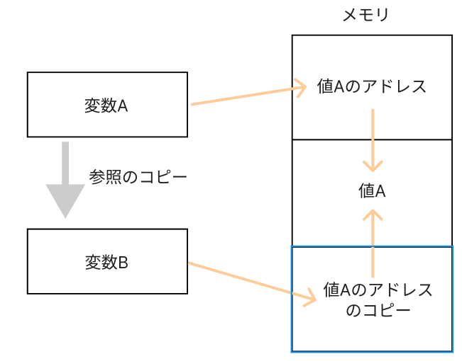
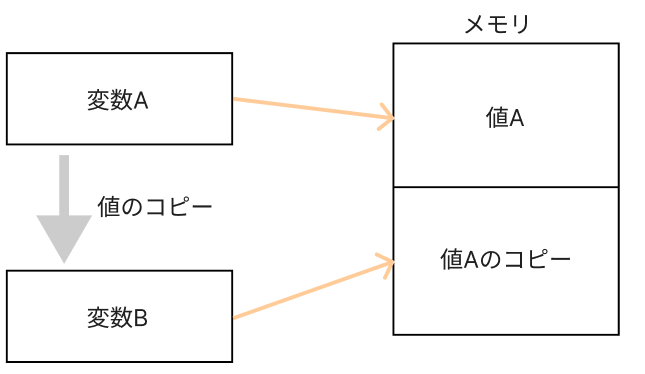

## はじめに

「JavaScriptでディープクローンをする方法と注意点」というタイトルで記事を書こうと思ったのだが、内容を考えているうちに、そもそも**プログラミングにおけるコピーには２つの意味がある**、というところから記事にしたくなった。

## 値のコピーと参照のコピー

**コピー**という単語そのものの意味がわからないということはないと思うが、プログラミング言語の文脈における**コピー**については、2つの意味がある。それは「値のコピー」と「参照のコピー」だ。それぞれについてまとめると以下のようになる。

### 値のコピー（Value Copy）

- **定義**: 変数から別の変数へデータをコピーする際に、そのデータの実際の値がコピーされる

- **例**: 基本的なデータ型（整数、文字列、真偽値など）では通常、値によるコピーが行われる

```javascript
let a = 10;
let b = a;  // 値のコピー
b = 20;

console.log(a);  // 出力: 10
console.log(b);  // 出力: 20
```

- **特性**: `a`と`b`は独立しており、`b`を変更しても`a`には影響がない

### 参照のコピー（Reference Copy）

- **定義**: 変数から別の変数へデータをコピーする際に、そのデータへの参照がコピーされる。

- **例**: オブジェクトや配列などの複合データ型では、通常参照によるコピーが行われる。

```javascript
  let obj1 = { key: 'value' };
  let obj2 = obj1;  // 参照のコピー

  obj2.key = 'new_value';

  console.log(obj1.key);  // 出力: new_value
  console.log(obj2.key);  // 出力: new_value
```

- **特性**: `obj1`と`obj2`は同じデータを参照しているため、`obj2`を変更すると`obj1`も影響を受ける。

## メモリから見る２つのコピーの違い

なぜ値コピーと参照コピーのような違いが発生するのか？それはメモリ上での動作が起因している。

各変数は、コンピュータのメモリ上の特定の位置（アドレス）にデータを保存するが、基本データ型（数値、文字列など）は通常、その値自体がメモリに格納される。一方で、複合データ型（オブジェクト、配列など）は、データの実体とそのメモリアドレスへの参照が格納される。

上記を図解すると以下のようになる。





## まとめ

値コピーと参照コピーの挙動の違い、またその違いを生み出すメモリの仕組みを理解することができた。
